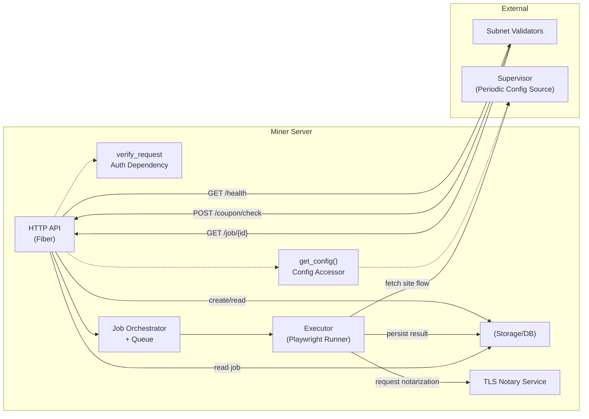
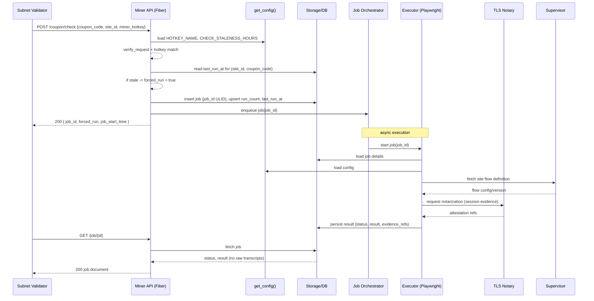

## BitKoop Miner Server – Architecture

This document illustrates the high-level architecture and request flows of the Miner Server.

### Component overview

Key points:
- `get_config()` is the single source for configuration (hotkey, staleness window, timeouts). It can later poll from the Supervisor without changing call sites.
- `verify_request` protects privileged endpoints; `/job/{id}` and `/health` are public.
- The Executor retrieves site flows from the Supervisor, performs Playwright executions, and coordinates with TLS Notary; only references/commitments are stored and exposed.
- Validators poll job results (pull model). Miners do not fan-out to validators.

### Request/Job lifecycle (sequence)

### Data model highlights

- Job
  - `job_id` (ULID/UUIDv7, opaque string)
  - `site_id` (int), `coupon_code` (text)
  - `status` (int)  :
     - PENDING - 1
     - RUNNING - 2
     - SUCCEEDED - 3
     - FAILED - 4
     - CANCELLED - 5
  - `job_start_time` (timestamp)
  - `result` (versioned payload, minimal evidence references)

- Coupon stats (per `(site_id, coupon_code)`)
  - `run_count` (int)
  - `last_run_at` (timestamp)
  - `last_job_id` (string, optional)

### Operational notes

- Use `get_config()` in all code paths needing configuration.
- Enforce staleness with `last_run_at`; dedupe concurrent checks.
- Keep `/job/{id}` public but non-leaky: return attestations/commitments only.
- Consider rate limiting `/coupon/check` and set `JOB_RETENTION_HOURS` for data lifecycle.

